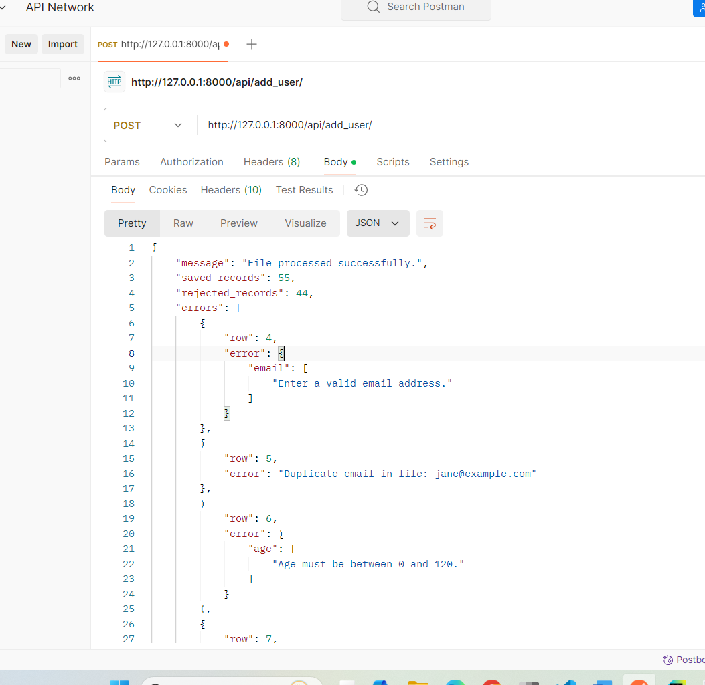

# API Development - Process User Data from a CSV File

This project provides a **Django REST Framework (DRF) API** that processes user data uploaded from a **CSV file**. The API validates the data and stores it in a `CustomUser` model, handling issues such as missing fields, invalid emails, invalid ages, and duplicate emails.


### Key Features:
- **CSV File Upload**: Upload user data in CSV format.
- **Data Validation**: Ensures the CSV file contains:
  - `name`: A non-empty string.
  - `email`: A valid email address.
  - `age`: An integer between 0 and 120.
- **Duplicate Email Handling**: Skips records with duplicate email addresses without causing errors.
- **Response Summary**: Provides details on the total records processed, saved, and rejected.

## Installation

### Start the Application Locally

1. **Clone the Repository**
   ```bash
   git clone https://github.com/AbidhSulaiman/API-Development.git


2. **Create and activate a virtual environment**
   ```bash
   python3 -m venv venv
   source venv/bin/activate # For macOS/Linux
   venv\Scripts\activate # For Windows

3. **Install Dependencies**
   ```bash
   pip install -r requirements.txt

4. **Apply Migrations**
   ```bash
   python manage.py migrate

5. **Run the Server**
   ```bash
   python manage.py runserver

## Test API


**Using Postman:**
- Open Postman and create a new request.

- Set the method to POST.

- Enter the URL: http://127.0.0.1:8000/api/add_user/

- Under the Body tab, select form-data.

- Add a key named file and upload the CSV file.

- Send the request.
## API Response Example




## Tech Stack

- **Backend**: Django, Django REST Framework (DRF)
- **Database**: SQLite
- **Testing**: Pytest
- **Serialization**: DRF Serializers for data validation


## Running Tests

To run tests, run the following command

```bash
  pytest
```

